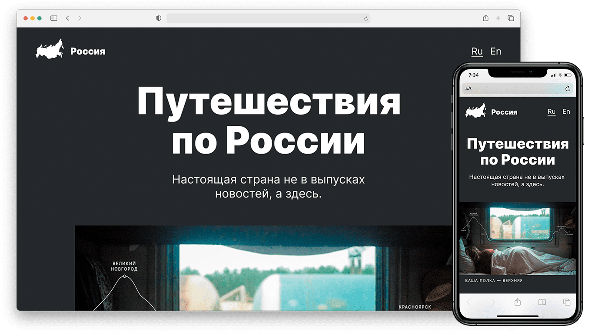

<p align="center">
  <picture>
    
  </picture>
</p>

# Путешествия по России  

Проект по созданию сайта с адаптивным дизайном о путешествиях по стране, выполненный  во время обучения веб-разработке в [Яндекс Практикум](https://praktikum.yandex.ru/)

Открыть демо:

[](https://tatsenko-m.github.io/russian-travel/)

<picture></picture>

## Функциональность
- Чтение текста
- Просмотр фотографий
- Ссылки, в том числе в виде интерактивной обложки
- Адаптивная верстка: сайтом удобно пользоваться на любом устройстве
- Возможность перелючаться между русской и английской версиями

## Технологии
* Флексбокс-вёрстка
* Grid Layout
* "Резиновая" вёрстка, относительные размеры `%`, `vw`, функция `calc()`
* Адаптивная верстка, медиазапросы `@media`
* Оптимизация шрифтов под разное разрешение, `font-smoothing`
* Относительное и абсолютное позиционирование элементов, `z-index`
* Изменение состояний элементов через `:hover` с плавным переходом `transition`
* Методология БЭМ. Файловая структура Nested

## Инструкция по установке
```bash
# Клонируем репозиторий
git clone https://github.com/tatsenko-m/russian-travel
# Заходим в папку с проектом
cd russian-travel
```
